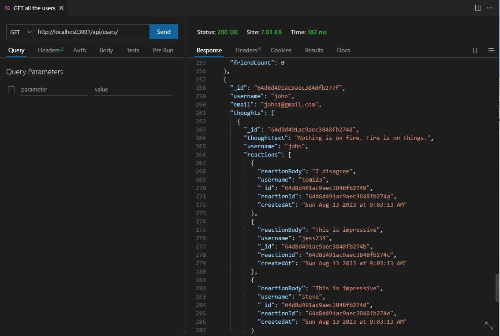
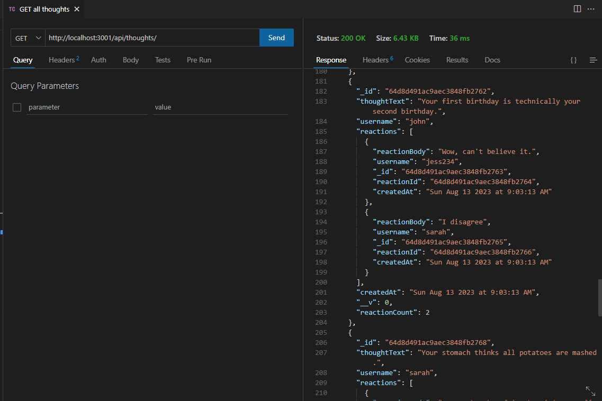

# Social Media API


## Description 

An API for a social network web application where users can share their thoughts, react to friends’ thoughts, and create a friend list. This app is using Express.js for routing, a MongoDB database, and the Mongoose ODM.

Link to the walk through video: 

## Table of Contents

- [Installation](#installation)
- [Usage](#usage)
- [Questions](#questions)
- [License](#license)

## Installation

To install necessary dependencies, run the following command:

```npm i```

To seed the database: 

```npm run seed```

To start application: 

```npm run start```

## Usage

To use the application, you can use Insomnia or Thunder Client. Test different routes to API GET, POST, PUT and DELETE users and thoughts as well as reactions to thoughts. Example routes provided below. 

Example GET route to show all the users: 

 

Example GET route to show all the thoughts: 

 

## Questions
GitHub profile: [vlada-caban](https://github.com/vlada-caban)

## License 
License: MIT